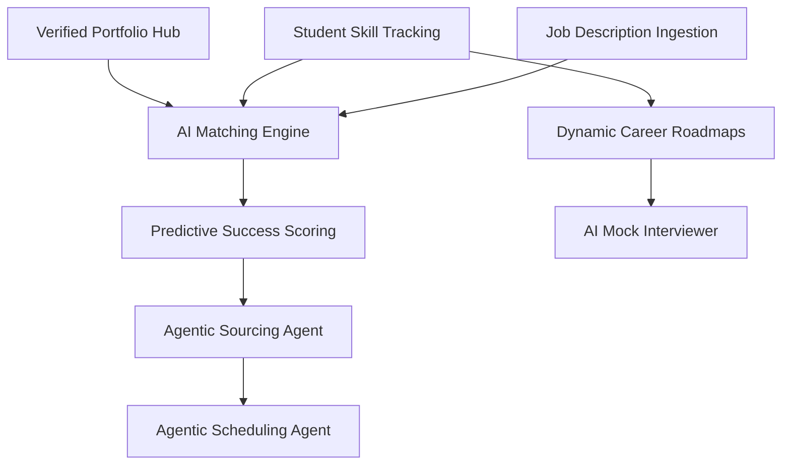

# Feature Landscape: ECHFLUX (AI-Powered Career Development & Hiring)

**Domain:** AI-Powered Career Development & Hiring Ecosystem
**Researched:** May 22, 2024 (Updated with 2025 Industry Trends)
**Overall confidence:** HIGH

## Table Stakes

Features users expect in any modern career platform. Missing these will cause immediate user friction or abandonment.

| Feature | Why Expected | Complexity | Notes |
|---------|--------------|------------|-------|
| **AI Resume Builder** | Students expect automated ATS optimization and keyword alignment. | Medium | Must support PDF export and live editing. |
| **Student Dashboard** | Central hub for tracking applications, skills, and recommended jobs. | Low | Core "Home" experience for the candidate side. |
| **Skills-Based Search** | Employers no longer search just by job title; they search for skill clusters. | Medium | Requires semantic matching (e.g., "React" matches "Next.js"). |
| **Company Dashboard** | standard ATS functionality: post jobs, manage pipeline, move candidates. | Low | Must be intuitive for recruiters used to LinkedIn/Workday. |
| **Basic Interview Scheduling** | Automated calendar sync (Google/Outlook) is now a baseline expectation. | Medium | Integration with external APIs (Calendly-style). |
| **Profile Integration** | Syncing data from GitHub, LinkedIn, or LeetCode to prepopulate profiles. | Medium | Reduces onboarding friction for students. |

## Differentiators

Features that set ECHFLUX apart and provide a competitive advantage (the "AI-First" value).

| Feature | Value Proposition | Complexity | Notes |
|---------|-------------------|------------|-------|
| **Agentic AI Layer** | Autonomous agents for sourcing, screening, and engagement (24/7 recruiter). | High | Moves from "tools" to "agents" that execute workflows. |
| **Predictive Success Scoring** | Matches based on "Potential" (Learning Agility, Cognitive Ability) not just past experience. | High | Uses the 40/20/20/20 matching formula (Skills/Exp/Proj/Pot). |
| **Dynamic Career Roadmaps** | Real-time learning paths that update based on industry trends and skill gaps. | High | Requires ingestion of job market data and MOOC content. |
| **AI Mock Interviewer** | Real-time audio/video simulation with specific behavioral feedback. | High | Differentiates from simple text-based chat coaches. |
| **Verified Portfolio Hub** | AI-validated projects (e.g., "Code quality is B+, confirms React hooks usage"). | Medium | Builds trust for employers by verifying student claims. |
| **Curriculum Gap Analysis** | For Universities: Shows what skills employers want vs. what students have. | Medium | Positions the platform as a B2B2C ecosystem (Schools-Students-Companies). |
| **Bias-Mitigation Engine** | Automated redaction of demographic data + skills-only screening audits. | Medium | Critical for enterprise DEI compliance in 2025. |

## Anti-Features

Features to explicitly NOT build to maintain the "Skills-First" and "AI-First" vision.

| Anti-Feature | Why Avoid | What to Do Instead |
|--------------|-----------|-------------------|
| **Manual Job Board UI** | Traditional "infinite scroll" lists lead to application fatigue and low match quality. | **Curated Feed:** Use "Netflix-style" recommendations based on match score. |
| **Degree/GPA-First Filtering** | Perpetuates bias and misses high-potential candidates from non-target schools. | **Skills-First Ranking:** Rank by verified skill proficiency and project outcomes. |
| **Black-Box Rejections** | AI rejections without explanation frustrate candidates and cause legal risk. | **Explainable AI:** Provide "Skill Gap" feedback (e.g., "You lack X skill for this role"). |
| **Synthetic/AI Avatars** | Can feel "uncanny valley" or impersonal, alienating top talent. | **Human-Centric UI:** Use AI for backend logic; keep frontend interfaces warm and human. |
| **Static PDF Resumes** | Resumes are stale the moment they are saved; they don't capture growth. | **Living Skill Profiles:** Dynamic profiles that update as students complete projects. |

## Feature Dependencies

- **Matching Engine (B)** requires data from **Portfolio (A)** and **Skill Tracking (C)**.
- **Agentic Sourcing (F)** depends on high-quality **Success Scoring (E)**.
- **Roadmaps (G)** depend on **Skill Tracking (C)** to identify current status.

## MVP Recommendation

To validate the "Skills-First" model while maintaining speed-to-market:

1. **Table Stakes Priority:**
   - Student Dashboard + Skill Tracking.
   - Company Dashboard + Basic Pipeline.
   - Semantic Match Score (Basic version).

2. **Core Differentiator (The "Hook"):**
   - **Verified Portfolio Hub:** Integrate GitHub/LeetCode first.
   - **Predictive Success Scoring:** Implement the 40/20/20/20 formula using LLM-based resume analysis.

3. **Phase 2 Expansion:**
   - Agentic Layer (Auto-scheduling & Sourcing).
   - Dynamic Career Roadmaps.

4. **Phase 3 Maturity:**
   - AI Mock Interviewer (A/V).
   - University Analytics (Curriculum Gap).

## Sources

- **Deloitte 2025 Human Capital Trends:** Research on Agentic AI in recruitment.
- **PwC 2025 Global AI Jobs Barometer:** Data on the "Skills Earthquake" and wage premiums for AI skills.
- **Eightfold.ai / Phenom People:** Competitive analysis of Talent Intelligence Platforms.
- **LinkedIn Future of Skills Report (2024):** Trends in skills-based hiring.
- **Teal / Careerflow.ai:** Best practices for AI resume building and candidate dashboards.
